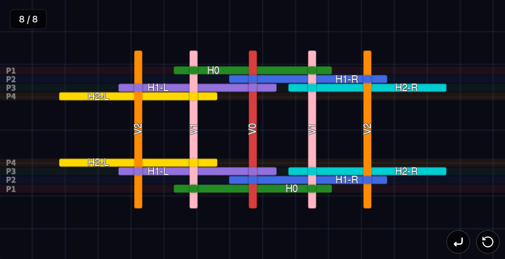

# Da Vinci Bridge Simulator (達文西橋搭建模擬器)

 

🔗 **Live Demo**: [https://liyoungc.github.io/da-vinci-bridge-sim/](https://liyoungc.github.io/da-vinci-bridge-sim/)

---

# 達文西橋 (Da Vinci Bridge) 搭建指南

這座橋樑的設計精妙之處在於無需任何釘子、繩索或黏著劑，僅靠木材之間的摩擦力和重力就能自我支撐。以下是詳細的搭建步驟分解。

### 結構示意圖 (Schematic)

## 定義與參數設定

### 幾何定義 (Definitions)

此部分為可讓使用者調整的基礎數值。

> **注意**：本模擬器預設使用**長寬高規格一致的方棍**（Square Beams），所有物理計算皆基於此假設。

| 符號 | 說明 |
| :---- | :---- |
| x | 棍長 |
| y | 棍寬 |
| z | 棍厚 |
| a | 水平棍的每一邊，與最外面的垂直棍交叉的中點，到自己邊緣的距離 |
| b | H0放在V1上面時，上、下兩個交叉點到V1上、下緣的距離 |
| s | 相鄰的水平棍間，因搭橋的現實因素，不可避免的間隙 |
| L | 層數 |
| Pmax | 最大單邊水平容許位置（最小為 3），預設值為4 |

### 位置參數 (Parameters)

用於計算水平棍放置的具體位置。

| 參數 | 計算公式 / 說明 |
| :---- | :---- |
| P1 | V0, V1..靠自己邊緣距離 b 的位置（供水平棍交叉的第一個位置） |
| P2 | V0, V1..靠自己邊緣距離 b + y + s 的位置（供水平棍交叉的第二個位置） |
| P3 | V0, V1..靠自己邊緣距離 b + 2y + 2s 的位置（供水平棍交叉的第三個位置） |
| ... | 以此類推 |
| P-cis | 若目前位置不許可或已達到 Pmax，則從 Pn+1 開始尋找；若到 Pmax 則從 P1, P2 開始尋找放置位置，P-cis為預設 |
| P-trans | 若目前位置不許可或已達到 Pmax，則從 Pn-1 開始尋找；若到零則回到 Pmax, Pmax-1 開始尋找放置位置 |

## 核心規則 (The Golden Rules)

在開始之前，請記住這兩個口訣，這適用於每一個交叉點，並需在每一次搭建完檢查：

1. **中間交叉 (Mid-span Crossing)**：垂直方向的棍子(Vx)永遠壓在水平方向的棍子（Hx）**上方**。
2. **末端交叉 (Tip Crossing)**：水平方向的棍子（Hx）的末端，永遠壓在垂直方向的棍子（Vx）**上方**。

### 攤平圖 vs 側視圖的差異

1. **攤平圖（俯視圖）**：假設所有棍子**沒有厚度**，純粹展示 X-Y 平面的交叉關係。
2. **側視圖（立體結構）**：必須考慮以下規則：
   - **H斜插法**：H1-R的放置位置:其下緣離最內側a距離的點，壓在V0的右上角，向右下方延伸，令其上緣正好與V1的左下角交會。H1-L、H2-R.. 等同理類推。
   - **非交會區域不重疊**：水平棍與垂直棍在側視圖中的面積**不能互相重疊**（因為它們在立體結構中有上下關係）。
   - **同類型可重疊**：只有水平棍與水平棍之間可以視覺重疊（因為它們在立體構造中並沒有交會，只是前後關係）。
   - **堆疊順序**：例如第二層從上到下應為 H1 > V2 > H2（H1 在最上，V2 在 H1 下方，H2 在 V2 下方）。

## 搭建法則

1. 結構上與下（橋的兩側）呈現鏡像對稱，左右（兩腳）則不會。
2. 輪流搭設左右兩邊。
3. 攤平時，所有水平棍的位置是互斥的，不會互相交叉。

## 第一階段：搭建核心模組 (The Core Module)

目標：建立橋樑的頂點和第一層結構。

### 步驟 1：設置底座 (V1)

- **材料**：2 根棍子

- **操作**：將這兩根棍子以垂直方向，平行放置在地面上，間距約為 x - 2a。
- **功能**：這是第一層的支點。

### 步驟 2：架設橫樑 (H0)

- **材料**：2 根棍子

- **操作**：將 H0 橫跨一上一下在兩根 V1 上，置於正中央，上下交叉點分別距離 H0 上下邊緣距離為 b，也就是P1位置。

### 步驟 3：放置頂點橫樑 (V0)

- **材料**：1 根棍子（**紅**）

- **操作**：將 V0 垂直放在 H0 的正中央上方。
- **檢查**：紅棍壓在綠棍中間（符合規則 1）。

## 第二階段：搭建第一層

目標：利用槓桿原理讓結構站立起來。

### 步驟 4 & 5：插入第一層支撐腿 (H1-R, H1-L)

- **材料**：4 根棍子

- **操作（關鍵步驟）**：
  1. 依上方"H斜插法"所述，俯瞰圖位置在P2。
  2. 對 H1-L 重複同樣的對稱動作，但基於水平棍互斥原則，H1-L 需放在 P3 位置。
- **物理機制**：
  - **支點**：V1
  - **抗力點**：V0（被 H1 壓住）

## 第三階段：擴展至第二層 (Expansion to the 2nd Layer)

目標：增加橋的高度與跨度。

### 步驟 6：加入第二層橫樑 (V2)

- **材料**：2 根棍子

- **操作**：
  - 將兩個 V2 分別放置在 H1-R, H1-L 的「**下方**」，距離它們的外側邊緣位置是 a。

### 步驟 7 & 8：插入第二層支撐腿 (H2-R, H2-L)

- **材料**：4 根棍子

- **操作**：
  1. 拿起 H2-R 兩根，重覆"H斜插法"，垂直位置在 P3，除非水平棍互斥，則需啟動P－cis或P-trans。
  2. 將其**外側**延伸，中心點穿過 V2「下方」。
  3. 對 H2-L 重複一樣動作，但垂直位置變成 P4，除非水平棍互斥，則需啟動P－cis或P-trans。
- **結構變化**：
  - 現在，**H2** 取代了 H1 成為新的「腳」。
  - **V2** 變成了新的支點。
  - 原本的底座（V1）被架到了半空中。

## 第四階段

### 重覆上一階段，每次可搭一層，P位置依P-cis或P-trans尋找

## 總結

這就是所謂的「互承結構」（Reciprocal Frame），每一根棍子都既支撐別人，也被別人支撐。不能讓每一個棍子有單獨的 z-index，要視交叉點的位置決定。

---

# Da Vinci Bridge Construction Guide (English Version)

The brilliance of this bridge design lies in its ability to support itself using only friction and gravity between the wooden beams, without any nails, ropes, or adhesives. Below is a detailed breakdown of the construction steps.

## Definitions & Parameters

### Geometry Definitions

This section lists the basic values adjustable by the user.

| Symbol | Description |
| :--- | :--- |
| x | Beam Length |
| y | Beam Width |
| z | Beam Thickness |
| a | Distance from the beam edge to the midpoint of the intersection with the outermost vertical beam |
| b | Distance from the intersection points (top and bottom) to the edges of V1 when H0 is placed on top |
| s | Gap between adjacent horizontal beams due to physical construction constraints |
| L | Number of Layers |
| Pmax | Maximum allowable horizontal position index (minimum 3), default is 4 |

### Position Parameters

Used to calculate the specific placement of horizontal beams.

| Param | Formula / Description |
| :--- | :--- |
| P1 | Position at distance `b` from the edge of V0, V1... (1st slot for horizontal beam crossing) |
| P2 | Position at distance `b + y + s` (2nd slot) |
| P3 | Position at distance `b + 2y + 2s` (3rd slot) |
| ... | And so on |
| P-cis | **Cis Mode**: If curr position is blocked or > Pmax, search from Pn+1; if Pmax reached, restart from P1, P2. Default. |
| P-trans | **Trans Mode**: If curr position is blocked or > Pmax, search from Pn-1; if 0 reached, restart from Pmax. |

## The Golden Rules

Before starting, remember these two rules applicable to every intersection, and check them after every step:

1. **Mid-span Crossing**: Vertical beams ($V_n$) must always rest **ON TOP** of Horizontal beams ($H_n$).
2. **Tip Crossing**: The tips of Horizontal beams ($H_n$) must always rest **ON TOP** of Vertical beams ($V_n$).

### Top View vs. Side View

1. **Top View (Flat)**: Assumes beams have **no thickness**, purely showing X-Y plane intersections.
2. **Side View (3D Structure)**: Must consider:
    - **H-Wedge Method**: For H1-R, place bottom edge at distance `a` from the inner side, resting on V0's top-right corner, extending down-right so its top edge meets V1's bottom-left corner. Apply similarly for H1-L, H2-R, etc.
    - **No Overlap in Non-Crossing Areas**: Horizontal and vertical beams cannot visually overlap in side view (due to vertical hierarchy).
    - **Same-Type Overlap**: Horizontal beams can overlap with horizontal beams visually (front-back relationship).
    - **Stacking Order**: e.g., Layer 2 from top to bottom is H1 > V2 > H2.

## Construction Principles

1. The structure is mirror-symmetric top-to-bottom (bridge sides), but asymmetric left-to-right (legs).
2. Build alternating left and right sides.
3. In Top View, all horizontal beam positions are mutually exclusive and strictly non-crossing.

## Phase 1: The Core Module

**Goal**: Establish the bridge apex and the first layer structure.

### Step 1: Set the Base (V1)

- **Material**: 2 beams

- **Action**: Place these two beams vertically and parallel on the ground, spaced `x - 2a` apart.
- **Function**: First layer pivot points.

### Step 2: Mount the Cross Beam (H0)

- **Material**: 2 beams

- **Action**: Place H0 across the two V1 beams, one above and one below, centered at P1 (distance `b` from edges).

### Step 3: Place the Apex Beam (V0)

- **Material**: 1 beam (**Red**)

- **Action**: Place V0 vertically centered on top of H0.
- **Check**: Red beam presses on the middle of the Green beam (Rule 1).

## Phase 2: Layer 1

**Goal**: Leverage leverage principles to lift the structure.

### Steps 4 & 5: Insert Layer 1 Legs (H1-R, H1-L)

- **Material**: 4 beams

- **Action**:
    1. Using the "H-Wedge Method", place H1-R at Top View position P2.
    2. Repeat for H1-L symmetrically, but place at P3 due to exclusion rules.
- **Physics**:
  - **Pivot**: V1
  - **Load**: V0 (Pressed down by H1)

## Phase 3: Expansion to Layer 2

**Goal**: Increase height and span.

### Step 6: Add Layer 2 Cross Beams (V2)

- **Material**: 2 beams

- **Action**: Place two V2 beams strictly **UNDER** H1-R and H1-L, at distance `a` from their outer edges.

### Steps 7 & 8: Insert Layer 2 Legs (H2-R, H2-L)

- **Material**: 4 beams

- **Action**:
    1. Take H2-R, repeat "H-Wedge Method", vertical pos at P3 (unless blocked, then use P-cis/P-trans).
    2. Extend its **outer** side so the center passes **UNDER** V2.
    3. Repeat for H2-L at P4 (unless blocked).
- **Structural Change**:
  - **H2** replaces H1 as the new "Leg".
  - **V2** becomes the new Pivot.
  - The original base (V1) is lifted into the air.

## Phase 4

### Repeat the previous phase, adding one layer at a time, finding P-positions via P-cis or P-trans

## Summary

This is the "Reciprocal Frame" structure. Every beam supports another while being supported itself. Beams do not have a single absolute Z-index; it depends on the specific intersection point.
